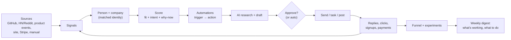
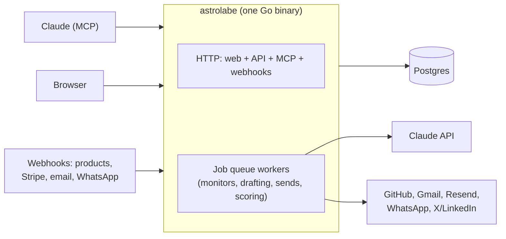

# Astrolabe

**Go-to-market for the everyday programmer.** You built something; Astrolabe helps people find it and pay for it. It watches for people who have the problem your product solves, drafts outreach you approve, follows up, and shows which efforts turn into users and revenue. You drive it from Claude (MCP) or a small web app, and you configure it the way you configure everything else: YAML and Markdown in a git repo.

Updated 24 September 2026.

## 0. Who it's for

Developers who ship products (dev tools, SaaS, apps) and would rather write code than learn five sales tools. You don't need to know what an "ICP" or a "nurture cadence" is: Astrolabe uses developer terms (events, rules, pipelines) and explains the rest in the glossary below. If you (or a teammate) do speak sales, those words work too.

**How it's delivered:** open source under AGPL-3.0 at github.com/astrolabe-gtm/astrolabe, shipped as a Docker image (`ghcr.io/astrolabe-gtm/astrolabe`) plus Postgres that you self-host, the way people run Mattermost or Penpot. Each developer or team runs their own instance for their own products; there are no shared accounts or multi-tenancy. A hosted version is an open decision (§14).

**Examples in this doc** use two products: *Geometer*, a developer tool that finds race conditions (cold outreach to engineers), and *Fair*, a consumer app (messages to existing users). Swap in your own.

**Glossary (what Astrolabe calls it, what sales tools call it, what it means):**

| Term | Meaning |
| --- | --- |
| Signal (intent data, buying signal) | An event about a person: they opened a GitHub issue about your problem, starred your repo, posted on HN, signed up. Stored once per dedupe key, like an idempotent event log. |
| Target (ICP, persona) | Who the product is for, in plain sentences (`target:` in `product.yaml`). |
| Fit rules (firmographics, technographics) | Machine-checkable version of the target: facts like `dep:bullmq` or `lang:typescript` with weights. |
| Score / priority (lead score, MQL) | `0.4·fit + 0.4·intent + 0.2·why_now`, 0–100. Priority A (≥70) means contact now; D means just watch. |
| Intent / why now | Recent signals, decaying with a 10-day half-life / time-sensitive signals in the last 14 days. |
| Sequence (cadence, campaign, nurture) | A timed list of message steps (`sequences/*.yaml`). `kind: cold` for people who don't know you yet, `kind: users` for existing users. |
| Automation (play, playbook, workflow) | A rule in `automations.yaml`: *trigger → when → action*, like a CI workflow. "On a `github.issue_pain` signal, if fit ≥ 50, start the `technical-intro` sequence." |
| Funnel / stages (pipeline, lifecycle stages) | Your product's pipeline states (`reached → replied → installed → first_finding → paid`). A person's furthest stage is their state. |
| Activation | The stage where a user first gets real value (the "aha" moment). The number to move. |
| Offer | The one concrete thing every message asks for: a promise, a call to action and a URL. |
| Attribution | Which signal, link or automation brought a person in, and what happened after. |
| Do-not-contact (suppression list, DNC) | People nobody will message again, across all your products (unsubscribes, bounces, "no"). |
| Auto-approve (autonomy) | Letting clean AI drafts send without your click: `none`, `follow_ups` or `all`. |

Both vocabularies work everywhere: the MCP tools map sales words to the same actions, and config files accept the sales keys as aliases (`icp`, `autonomy: manual/first_step/auto`, `sender.outbound/lifecycle`, `limits.outbound_per_day`, `kind: outbound/lifecycle`, `plays.yaml`). Giving both forms of one setting is an error.

## 0.1 Getting started, for a developer

The first five minutes need no accounts. `astrolabe init -template demo` writes a workspace (a demo product, JSON schemas, `compose.yaml`, `.env`), and `docker compose up` starts it in **sandbox mode**:
- Every channel delivers to a local **Outbox** (web page and MCP tools) instead of a provider.
- The Outbox can **simulate a reply or bounce** through the real reply-matching code, so sequences stop, replies appear to label, and bounces add people to do-not-contact exactly as they would live.
- The mode is recorded in the database on first start and a different mode is refused later, so test data and real sends never share a database (`astrolabe mode set` switches deliberately). A banner shows on every page, MCP results carry the mode, and demo products (`demo: true`) only load in sandbox.

Then, for a real product:
- **`astrolabe init -template devtool|saas|app`** writes a product folder with starter monitors, automations and sequences. Claims and voice start as `STUB:` files, so nothing is sent until you write them.
- **JSON schemas** for `product.yaml`, `sequences/*.yaml`, `automations.yaml` and `monitors.yaml` are generated from the config structs (`astrolabe schema`). Each YAML file references them, so editors autocomplete keys, explain them on hover and flag typos; the schemas include the sales aliases.
- **`astrolabe doctor`** checks the database, mode, products, a connected mailbox for every sender address, channel secrets, public URL, webhooks and tokens, and prints the exact fix for each problem. `-connect` also tests SMTP/IMAP logins, the GitHub token, the Claude key and SPF/DMARC, without sending anything.
- **Simple email:** connect any mailbox with SMTP/IMAP and an app password (Settings or `astrolabe mailbox add`), with presets for Gmail, Fastmail, iCloud and Zoho. See §7.

## 1. Principles

1. **Capability without machinery.** A full GTM loop (monitoring, scoring, sequences, funnels, experiments) in one Go binary and one Postgres database. Nothing else to run.
2. **Config as code.** Each product is a folder of YAML and Markdown you keep in git, review in PRs and validate in CI (`astrolabe product validate`). Setting up a new product should take an hour, not a week.
3. **Comfortable for developers, fluent in sales.** Tools, pages and config keys are named in terms a programmer already knows, and GTM concepts are explained where they appear. Sales vocabulary still works: ask Claude to "enroll these leads in a cadence" or "show my MQLs" and it maps to the same tools. A founder, a developer or a salesperson can all use it.
4. **Signals drive the work.** Nothing is sent to a list just because the list exists. Every message traces back to something the person did or something that happened.
5. **You approve, then you trust.** Every product starts with every message needing your approval. You turn on `auto_approve` per product once the drafts are consistently good; flagged drafts always wait.
6. **Honest numbers.** Funnel and attribution come from events you can inspect. No vanity scores, no modelled attribution you can't explain.
7. **Integrate the minimum.** Use APIs where they're reliable (GitHub, email, Stripe, webhooks). Where automation gets accounts banned (LinkedIn, X DMs), produce a ready-to-paste task instead.
8. **Conversion before coverage.** Start with one target, one offer and one automation per product. Add a monitor or channel only when it helps a specific bottleneck. Success is people reaching value and paying.

## 2. The loop



The same loop covers every GTM motion:
- **Cold outreach** (Geometer): a GitHub signal leads to research notes, then an email sequence.
- **Users** (Fair): a user stalls after KYC, so they get a WhatsApp or push nudge toward the first lesson.
- **Content**: a release note becomes launch posts.
- **Community**: a Hacker News thread becomes a task for you to reply in person.

## 3. Products

Each product is a folder `products/<id>/` with `product.yaml` plus a few markdown files. The AI builds the first version by interviewing you in chat, and you edit it from there.

```yaml
id: geometer
name: Geometer
url: https://geometer.dev
one_liner: Finds race conditions in async workflows and hands you a 5-step replay.
audience: b2b                  # b2b (accounts + people) or b2c (users)

target:                         # who it's for, in plain sentences
  include:
    - TypeScript/Node backend with Postgres and a queue (BullMQ etc.)
    - Handles payment/commerce webhooks (Stripe, Razorpay, Shopify)
    - 5–50 backend engineers
  exclude:
    - Pure frontend teams

funnel:                         # ordered; each stage is an event name
  - reached
  - replied
  - site_visit
  - installed                   # npx geo test
  - first_finding               # aha moment
  - ci_enabled
  - paid

activation: first_finding       # the stage that defines "activated"

offer:
  promise: "Help you test one async workflow and inspect the result"
  cta: "Send one workflow you'd like to test"
  destination: https://geometer.dev/start
  success_event: first_finding
  window: 14d                  # observation window, not a promised result

claims:                         # the only product claims the AI may make
  allowed: claims.md
  never:
    - "guarantees no bugs"
    - "zero false positives"

voice: voice.md                 # tone, examples, words to avoid
sender:
  cold: you@try-geometer.example   # cold email, from a separate domain
  users: hello@geometer.dev

auto_approve:                   # which AI drafts go out without your click: none | follow_ups | all
  cold: none
  users: none
limits:
  cold_per_day: 40
  touches_per_person_per_week: 2

fit:                            # facts come from enrichment, import or chat
  - {any: [dep:bullmq, dep:bee-queue], weight: 35, label: job queue}
  - {any: [lang:typescript], weight: 20, label: TS/Node}
  - {any: [dep:stripe, dep:razorpay], weight: 30, label: payment webhooks}
  - {any: [dep:react-native], exclude: true, label: mobile app repo}
```

Other files in the folder:

| File | Purpose |
| --- | --- |
| `claims.md` | What is true about the product, with proof links. Drafts may only use these. |
| `voice.md` | Tone plus 3–5 example messages you're happy with |
| `objections.md` | Common objections and honest answers, used for reply drafts |
| `monitors.yaml` | Which signal sources are on and their settings (§4) |
| `automations.yaml` | Trigger → action rules (§6) |

**One concrete offer.** Each product starts with the offer above; an automation may override it. The message, landing page and next step must make the same promise. Use the existing product site or onboarding flow, carrying a automation/link ID through signup where possible. If people click but never reach value, improve that step before finding more people. Astrolabe does not need a landing-page builder.

## 4. Signals

A **monitor** produces signals. Monitors are either scheduled (polling) or event-driven (webhooks). They are built in once and configured per product.

| Monitor | Type | Example signals | Products it suits |
| --- | --- | --- | --- |
| `github_search` | Scheduled, hourly | Issues/PRs mentioning "race condition", "processed twice"; repos adding `bullmq` | Dev tools |
| `github_repo` | Scheduled | Stars, forks and issues on your repos or a competitor's | Dev tools |
| `community` | Scheduled, hourly | HN, Reddit, Lobsters, Stack Overflow, RSS keyword matches | All |
| `product_events` | Webhook | signup, activated, stalled, limit hit, invited teammate | All (your apps send these) |
| `site` | Webhook or PostHog | Pricing or docs visits by a known person | All |
| `stripe` | Webhook | Trial, upgrade, failed payment, churn | All paid products |
| `inbox` | Webhook | Replies, bounces, unsubscribes | All |
| `manual` | Chat or CSV | "Add these 30 people", a forwarded email | All |

Monitors are configured in `monitors.yaml`:

```yaml
- id: pain-issues
  type: github_search            # github_search | github_repo | community
  query: '"processed twice" webhook is:issue language:TypeScript'
  signal: github.issue_pain
  strength: 25
  why_now: false                  # true for time-bound triggers (postmortems, launches)
  every: 1h
- id: community
  type: community
  keywords: ["webhook idempotency"]
  sources: [hn, stackoverflow, rss]   # Reddit needs OAuth; add its RSS feeds under feeds: instead
  feeds: []
  signal: community.thread
  strength: 5
  every: 2h
```

Each run looks back to the previous successful run (a week on the first run), and GitHub searches are date-bounded because search returns at most 1,000 results. One failing source doesn't stop the others; errors show on the Signals page.

Every signal is stored in the same shape:

```json
{
  "product": "geometer",
  "type": "github.issue_pain",
  "occurred_at": "2026-09-24T10:12:00Z",
  "subject": {"github": "octo-dev", "email": null, "company_domain": "acmepay.io"},
  "strength": 25,
  "evidence_url": "https://github.com/acmepay/api/issues/812",
  "data": {"title": "Webhook processed twice on retry"},
  "dedupe_key": "gh-issue:acmepay/api#812"
}
```

**Identity matching.** Signals attach to a **person**, and in B2B also to a **company**. Match people through verified links between email, GitHub login and product user ID; product user IDs are scoped to their product. A company domain groups accounts, never merges coworkers into one person. Matches are deterministic only, with no fuzzy merging. If a link is ambiguous it goes to a review list and is never guessed.

**Enrichment**, cheapest first:
1. Public GitHub profile and repo data: the profile's name, `@org` company and public email; the signal repo's languages (≥10% of code) and declared dependencies (`package.json`, `requirements.txt`, `go.mod`) become facts like `lang:typescript` and `dep:bullmq`. Facts from an org's repo belong to the company.
2. The company website
3. An optional paid email finder, only for people at priority A or B

## 5. Scoring

Scoring uses simple rules you can read, defined per product:

- **Fit (0–100):** `fit` rules from `product.yaml`, each matching any of a list of facts and adding a weight (the free-text `target` is for people and prompts). An exclude rule makes the person ineligible for acquisition automations, regardless of the combined score.
- **Intent (0–100):** a sum of recent signal strengths that decays over time, with a default half-life of 10 days: `intent = min(100, Σ strength × 0.5^(days/10))`.
- **Why-now (0–100):** a time-bound trigger in the last 14 days, such as a postmortem, funding, a new reliability hire, or a stalled onboarding.

`priority = 0.4·fit + 0.4·intent + 0.2·why_now`

| Priority | Score | What happens |
| --- | --- | --- |
| A | ≥ 70 | Research research + personal outreach. It appears at the top of your inbox. |
| B | 50–69 | Brief + sequence (approval per product auto_approve) |
| C | 30–49 | Watch; newsletter only if subscribed |
| D | < 30 | Watch |

Each score shows its breakdown ("fit 80: TS+Postgres+BullMQ; intent 45: issue 3d ago, starred repo"). Scores rank eligible prospects; they do not authorize contact. Existing users qualify for users help through product state and channel permission, without needing an acquisition score. Recompute time-dependent scores daily as well as on new signals. Learned models can come later, once there are a few hundred outcomes to learn from.

## 6. Automations: the growth-hacking unit

A **automation** is `trigger → audience filter → action`. It is how one experiment in growth becomes a repeatable machine.

```yaml
# products/geometer/automations.yaml
- id: pain-issue-outreach
  notes: "Audience, offer, max effort — written before starting"
  trigger: {signal: github.issue_pain}
  when: {min_fit: 60, not_contacted_within: 30d}
  action: {sequence: technical-intro}
  success: {event: first_finding, within: 14d}   # default: the product offer
  limit_per_day: 10

- id: postmortem-offer
  trigger: {signal: community.postmortem}
  when: {min_fit: 60}
  delay: 5d                         # never during the incident; rechecked when due
  action: {sequence: free-workflow-test}

- id: stalled-install
  trigger: {stage_stuck: {stage: installed, for: 3d}}
  action: {sequence: first-finding-help}

- id: hn-thread
  trigger: {signal: community.thread}
  action: {task: "Reply personally", draft: true}   # I post it myself
```

```yaml
# products/fair/automations.yaml
- id: kyc-no-trade
  trigger: {stage_stuck: {stage: kyc_done, for: 2d}}
  action: {sequence: first-strategy-lesson}

- id: winback
  trigger: {stage_stuck: {stage: active, for: 21d}}
  action: {sequence: whats-new}
```

Triggers are one of `signal: <type>`, `stage: <entered stage>` or `stage_stuck: {stage, for}`. Filters (`when`) are structured rather than an expression language: `min_fit`, `min_priority`, `min_tier`, `not_contacted_within`, `not_stage`, and `include_excluded` for acquisition automations that should ignore fit exclusions (stage-triggered automations for existing users ignore them by default). Signal automations wait up to 30 minutes for a new person's GitHub enrichment so they aren't judged on missing facts.

Automation **templates** cover the common moves, so a new product starts with a working set:

| Template | What it does |
| --- | --- |
| Signal outreach | A high-intent person gets a personal intro |
| Stalled activation | Someone stuck before the aha moment gets help |
| Trial conversion | A trial user near the end of the trial gets a nudge |
| Win-back | An inactive user gets a "what's new" message |
| Referral ask | A newly activated happy user is asked to refer |
| Launch | A release produces launch posts and a list of targets |
| Community reply | A relevant thread becomes a drafted reply task |

**An automation has an outcome, not just an action.** It inherits the product offer and success event unless overridden. Before starting, record the audience, offer, success event, observation window and maximum effort/spend in the automation file. Start with one small batch you can personally follow through. At review, keep, change or stop it based on activation, payment and what people said; replies and clicks are intermediate signals.

**Prevent competing nudges.** Allow one active conversion sequence per person per product. Before every step, recheck that the person is still eligible and has not reached the goal, replied or started a human conversation. A delayed `stage_stuck` automation must recheck the stall when it runs. Win-back uses time since the last meaningful activity, not time since the first `active` event. A completed purchase or activation cancels obsolete pending messages.

## 7. Outreach and messaging

**Sequences** are ordered steps with delays. Each step targets a channel:

```yaml
# products/geometer/sequences/technical-intro.yaml
steps:
  - {channel: email, after: 0d,  brief: true, goal: "offer to test one workflow free"}
  - {channel: email, after: 3d,  goal: "share a relevant replay example"}
  - {channel: linkedin_task, after: 5d, goal: "connect with a short note"}
  - {channel: email, after: 9d,  goal: "polite close-the-loop"}
stop_on: [replied, unsubscribed, bounced, installed]
```

| Channel | How it sends |
| --- | --- |
| `email` (cold) | Any mailbox on a separate sending domain, over SMTP with an app password (the simple setup) or through the Gmail API with OAuth. Replies and bounces come back over IMAP (or the Gmail API) from the same mailbox. |
| `email` (users) | Resend on the product domain when `ASTROLABE_RESEND_API_KEY` is set (with an idempotency key per message), else the Gmail mailbox |
| `whatsapp` | Meta WhatsApp Cloud API with approved templates (Fair). The step names the template, language and parameters; the draft shows the template as its subject and one parameter per line. Needs `whatsapp.phone_number_id` in `product.yaml` and an explicit WhatsApp opt-in from product events. Replies arrive at `/hooks/whatsapp` (Meta signature); "STOP" unsubscribes |
| `push` / `in_app` | A product webhook: Astrolabe posts a signed `{id, channel, user_id, title, body}` to `notify.url`, and the product's own notification service delivers it (Fair). `id` is stable per message for dedupe |
| `linkedin_task`, `x_task` | A task in your inbox with the text ready; you send it by hand and mark it done |
| `webhook` | Any product-specific action |

Sequences have a `kind`: `cold` (people who don't know you; counts toward `limits.cold_per_day`) or `users` (existing users; WhatsApp, push, in-app and webhook are users-only, and a channel the user declined in product events is never used). The weekly touch cap covers both.

**Drafting.** When the Claude API is configured, every empty draft is written by a background job; without it, drafts wait for you or for Claude over MCP. The AI writes from:
- the person's research notes and triggering signal
- `claims.md`, `voice.md` and the step's goal

It must cite the signal it references. Drafts are flagged for a never-claim, a leftover placeholder, no reference to the triggering signal, or excessive length. Flagged drafts always wait for you. `auto_approve` per product (`none`, `follow_ups`, `all`, separately for `cold` and `users` sequences) only approves unflagged AI drafts, through the same approval checks as yours. An edit you make while Claude is drafting wins.

**Approvals.** The inbox shows the exact message, the reason ("issue #812, 3 days ago"), and the person's score. From there you can approve, edit, skip or snooze. Edits are saved as examples for the product's voice.

**Automatic stops and classification.** Replies are sorted into interested, question, not now, no, out of office, or unsubscribe. A small fast model suggests the class; at 85% confidence or more it is applied for you, otherwise it is shown as a suggestion:
- Interested replies and questions become drafted answers in your inbox.
- "No" and unsubscribe add the person to do-not-contact.
- Any reply stops the sequence.

**Close the conversation.** An interested reply becomes a task with one next action and a due date: answer a question, help with setup, review a result or send the appropriate purchase link. You handle these before approving new cold outreach. "Not now" can become a reminder for the time they requested; it does not silently restart the sequence. Record a short outcome when closing the task: activated, paid, wrong fit, unclear value, setup blocked, price or later. These reasons tell you what to fix in the offer or product.

**Email over SMTP/IMAP.** A rejection at any SMTP stage (connect, login, MAIL, RCPT, DATA, or the reply to the final ".") means *not sent*. Only a lost answer after the message was fully transmitted is *unknown*. Providers other than Gmail don't file SMTP sends in Sent, so Astrolabe appends a copy there; "Check Sent mail" searches Sent by Message-ID, and says so honestly when a missing copy proves nothing. Replies are polled from the inbox by UIDVALIDITY and last UID, and matched by our Message-ID in `In-Reply-To`/`References`; follow-ups carry the full `References` chain so replies thread in every client. Mailbox credentials live in the secrets volume (mode 0600), never in the database. Microsoft mailboxes are not preset: Microsoft is retiring password SMTP/IMAP.

**Safety rules the code enforces:**
- Each send has one durable row in `actions`, unique on `(enrollment_id, step)`. A worker atomically claims it and rechecks stops, do-not-contact and limits before attempting delivery. Job uniqueness prevents duplicate work records; it does not guarantee exactly-once delivery through an external API. Use the same provider idempotency key where supported. [River's unique jobs](https://riverqueue.com/docs/unique-jobs) are a queue primitive, not a delivery receipt.
- If the provider's result is unknown, the step is marked `unknown` and never re-sent automatically.
- Approval applies to the exact recipient, channel and message shown. Changing any of them requires approval again; stale approved drafts still pass the send-time checks.
- Do-not-contact covers unsubscribes, bounces, "no" replies and a manual list. It applies across all products for the same person, and is checked right before sending.
- Per-product daily limits and per-person weekly touch caps.
- **Pause buttons:** one global pause, one per product and one per sequence. They stop sends at the next check.

## 8. Content and launches

- **Repurpose:** a release note, blog post or changelog becomes drafts for X, LinkedIn, HN, Reddit and a newsletter, each in the product's voice.
- **Launch checklist per product:** HN, Product Hunt, relevant subreddits, newsletters and directories. Each gets a drafted post and is tracked as a task.
- **Posting stays manual:** each draft can become a task; you post it and mark it posted with the URL (API posting to X/LinkedIn is not built).
- Every public link gets a tracked short link (`<ASTROLABE_PUBLIC_URL>/l/<code>`) with UTM tags and `ref=<code>`, so the funnel can attribute it (§9). Outreach drafts get a per-message link too (`{{.Link}}` in templates; AI drafts have the offer URL swapped for it before approval). A click on a personal link is a `link.click` signal and a `site_visit` stage if the funnel has one; mail-scanner clicks are ignored. A signup event carrying `data.ref` credits its first touch to that link.

## 9. Funnel, attribution and experiments

**Funnel.** Stages come from `product.yaml`. A person enters a stage the first time its event arrives, from:
- outreach events (reached, replied)
- product webhooks (installed, activated)
- Stripe (paid)

The dashboard per product shows:
- people per stage, with conversion and median time between stages, weekly
- where people are stuck, and how many, which feeds the `stage_stuck` automations
- revenue from Stripe, per stage cohort

**Product events** arrive at `POST /hooks/events/<product>`, signed like Stripe webhooks (`Astrolabe-Signature: t=<unix>,v1=<hex HMAC-SHA256 of "t.body">`, 5-minute tolerance) with the secret in `ASTROLABE_EVENTS_SECRET_<PRODUCT>`:

```json
{"id": "evt-123", "type": "installed", "user_id": "u42", "email": "ana@acmepay.io",
 "occurred_at": "2026-09-24T10:00:00Z", "data": {}, "consent": {"whatsapp": true}}
```

`type` equal to a funnel stage records that stage; every event is also a `product.<type>` activity signal (used for stalls and win-back). Sending `user_id` with `email` links the product account to earlier outreach. `{"events": [...]}` batches work too. Stripe posts to `/hooks/stripe/<product>` with the endpoint's `whsec_` secret in `ASTROLABE_STRIPE_SECRET_<PRODUCT>`: `invoice.paid` and one-off `checkout.session.completed` record payments and `paid`; `charge.refunded` records refunds; trial, failed-payment and cancellation events become signals (and `trial`/`churned` stages if the funnel has them). Pass the product user id as Checkout's `client_reference_id` or `metadata.user_id` to join payments to users. Every webhook is idempotent by provider event id.

**Measure from the first batch.** M1 records the originating automation, contact date, next action and outcome, with manually recorded product outcomes until webhooks arrive. Show eligible people → contacted → replied → activated → paid, with actual counts and a fixed observation window. Recent cohorts still inside that window are labelled incomplete. A signup can arrive without replying; missing earlier events stay unknown rather than being invented. Count each person once per stage and each payment once by its provider event/transaction identity; payment and refund records remain available separately from the first `paid` milestone.

Show direct channel/enrichment/model spend per activated and paying customer, plus estimated operator minutes per automation. With zero conversions, show spend and zero conversions rather than a misleading cost per conversion. These are observed acquisition costs, not proof that the automation caused the purchase.

**Attribution** has three layers:
1. **Source:** the first touch that brought a person in: a monitor, an automation, or a post link/UTM.
2. **Influence:** every automation and sequence that touched them before they advanced.
3. **Matching:** a signup's email, or the product user ID sent back in `product_events`, joins them to earlier outreach.

That's enough to answer questions like "which automation produces paying users", and nothing more elaborate.

**Experiments.** Any sequence step can have `variants` (each overriding subject, body or goal). Assignment is random per person and fixed once made. The experiment report compares how many people reach the next funnel stage, with counts and a simple confidence interval. It flags when there's too little data to call a winner (fewer than 30 sends per variant, or overlapping 95% Wilson intervals).

At low volume, run one offer and read the replies before adding variants. Once volume supports comparison, change one thing at a time and judge it on the preselected success event/window. Use company-level assignment for B2B automations that contact multiple coworkers. A small randomized no-message group can later test whether users nudges add conversions; source attribution alone cannot answer that.

**Weekly digest**, by email (Mondays from 08:00, to `ASTROLABE_DIGEST_TO`), on the Digest page and in chat, per product. Its actions are rule-based from the numbers, not generated prose:
- what moved and which automations and variants are winning
- where people are stuck
- A-tier accounts not yet contacted
- the biggest observed conversion drop and up to three actions for the week, each tied to people or a specific product/offer change

## 10. How you use it

**AI chat (primary).** Astrolabe is an MCP server (`astrolabe mcp`), so Claude Desktop or Claude Code is the interface. Tool names are plain verbs; each description also lists its sales-term equivalents, and the server's instructions map sales jargon to tools, so "enroll these leads in the intro cadence" and "start the intro sequence for these people" both work. Claude answers in whichever vocabulary you use.

| Tools | Example |
| --- | --- |
| `product_setup`, `products`, `product_context` | "Set up a new product called X": Claude interviews you, then writes `products/x/` (claims and voice stay stubs until you agree them) |
| `top_prospects`, `person`, `people`, `signals` | "Who should I contact for Geometer this week?", "Tell me about acmepay" |
| `add_signal`, `set_facts`, `import_people` | "Bo referred Ana at acmepay", "Ana's team uses BullMQ", "import this CSV" |
| `ambiguous_matches`, `resolve_match` | "Which signals couldn't be matched to one person?" |
| `monitors`, `run_monitor` | "Run the processed-twice search now" |
| `research` | "Research the top 10 priority-A people" |
| `inbox`, `write_draft`, `ai_draft`, `approve`, `skip`, `resolve_send` | "Show today's drafts", "approve 1–5, rewrite 6 shorter" |
| `label_reply`, `answer_reply` | "Ana is interested; answer that yes, BullMQ works" |
| `start_sequence`, `pause`, `resume`, `do_not_contact` | "Start technical-intro for these 20", "pause all Fair sends", "never contact bo@x.com" |
| `add_task`, `close_task`, `record_stage` | "Remind me to help acmepay tomorrow", "mark them activated; setup took 20 minutes" |
| `automations`, `automation_runs` | "Why did pain-issue-outreach skip people today?" |
| `funnel`, `experiments`, `digest` | "Why did activation drop last week?", "which intro variant wins?" |
| `content`, `content_list`, `content_mark` | "Turn the v0.4 release notes into launch posts" |

Monitors, automations and sequences are files: ask Claude to edit `monitors.yaml` or `automations.yaml`, then reload (Settings, or restart).

**Web app (for speed).** Server-rendered pages. Each explains its terms in one line and points at the file that configures it:
- **Inbox:** sends needing a decision, replies to label (with Claude's suggestion), due to-dos with suggested text and an outcome, then drafts to write and approve (⌘↵ approves, flags shown)
- **Signals:** live event feed filterable by product, type and priority; ambiguous matches; monitor status with "Run now"; add a signal by hand
- **Automations:** each rule's trigger, action and counts, and recent runs with skip reasons
- **People** and a **person page:** import, search, priority with breakdown, facts, research notes, signals, messages; start a sequence; do not contact
- **Funnel:** stages, time between stages, who's stuck, revenue, where people came from and what each automation led to, experiments, cohorts, spend, record a stage by hand
- **Content:** draft posts from release notes, launch to-dos, mark posted with click counts
- **Digest:** the latest weekly summary and a preview
- **Settings:** pause switches, mailboxes, webhook URLs and secrets, product reload

**CLI.** `astrolabe init`, `astrolabe doctor [-connect]`, `astrolabe mailbox add|list|test|remove`, `astrolabe mode [set sandbox|live]`, `astrolabe schema [dir]`, `astrolabe serve` (migrates on start), `astrolabe migrate`, `astrolabe product validate [dir]`, `astrolabe import -product <id> <csv>`, `astrolabe monitor run <product> <monitor>`, `astrolabe score [product]`, `astrolabe gmail auth <address>` (one-time OAuth for a sending mailbox), `astrolabe mcp` (stdio MCP server for Claude).

## 11. Architecture



| Concern | Choice | Why |
| --- | --- | --- |
| Language | Go | Lightweight; one static binary |
| Database | Postgres | Everything in one place, including the job queue |
| Jobs, schedules, delays | [River](https://riverqueue.com) (Postgres-backed queue) | Durable retries and scheduled jobs without running Temporal or Pub/Sub |
| Web UI | Server-rendered HTML (Go `html/template`, plain forms), embedded in the binary | No frontend build, no code generation; add htmx only where a page needs it |
| DB access | pgx with hand-written SQL; migrations embedded and applied by `astrolabe migrate` | No ORM and no codegen step |
| LLM | Claude API: a stronger model for research notes and drafts, a small fast one for classification | Behind one `llm` package that logs prompt, model, cost and output per call |
| Secrets | Environment variables or GCP Secret Manager | API keys never enter the database |
| Hosting | Start with one small VM running the binary and Postgres; use Cloud SQL when managed backups/recovery justify the cost | One deployment to operate; price the chosen region, disk and backups before committing. Cloud Run is an alternative with the worker configuration below. |
| Infrastructure | Terraform (`deploy/terraform/`): one VM with Postgres and Caddy, static IP, IAP-only SSH, the env file in Secret Manager, daily dumps to a versioned bucket; `deploy/deploy.sh` ships the binary and product folders | One tool to create and change hosting; Cloud SQL later by changing the database URL |
| Local dev | `docker compose up` (Postgres) + `go run ./cmd/astrolabe serve` | |

**Keep deployment boring.** Run the service under a restart supervisor, require operator authentication for web/MCP access, verify incoming webhook signatures, and keep daily database backups off the VM with a tested restore. River workers need CPU even when nobody is using the web app. If using Cloud Run, configure instance-based billing and at least one minimum instance, and handle shutdown/recovery; request-based scale-to-zero hosting does not keep this polling loop running. Budget that always-running capacity plus Cloud SQL separately. See [Cloud Run's background execution guidance](https://docs.cloud.google.com/run/docs/configuring/billing-settings).

**Data model** (every table has `product_id` where relevant):

| Table | Holds |
| --- | --- |
| `products`, `sequences` | Loaded from `products/*/` (config, automations, monitors and claims/voice text), versioned by file hash |
| `companies`, `people`, `identities` | Matched entities with enrichment `facts`; `identities` maps email, GitHub, product user id (`<product>:<id>`), phone, HN, Stack Overflow and Stripe customer to a person |
| `product_people` | Which products a person belongs to, with the first-touch `source` |
| `signals`, `identity_reviews`, `monitor_runs` | Every signal (§4), unique on `(product_id, dedupe_key)`; ambiguous matches; monitor status |
| `scores` | Current fit/intent/why-now/priority with breakdown; recomputed on new signals, enrichment and daily |
| `play_runs` | Each automation run, once per trigger: started a sequence, created a task, or skipped with the reason (internally, automations are "plays") |
| `enrollments` | A person in a sequence (a sequence run): next step, status, stop reason, automation, triggering signal, goal stage; one active per person per product |
| `actions` | Every message, manual task or reply answer: draft → approved → sent/unknown/failed/blocked/skipped; unique `(enrollment_id, step)`; AI state and flags, variant, tracked link |
| `tasks` | Human follow-through: next action, due date, suggested text, outcome and minutes |
| `replies` | Inbound email and WhatsApp messages with classification and suggestion |
| `suppressions`, `channel_permissions`, `pauses` | Do-not-contact (global per person), users consent per channel, pause switches |
| `funnel_events` | Stage entries, deduplicated, with source |
| `payments`, `webhook_events` | Payments and refunds once per provider transaction; processed webhook ids |
| `briefs`, `llm_calls`, `voice_examples` | AI research, every model call with tokens, your edits of AI drafts |
| `links`, `clicks`, `assignments`, `content_items`, `digests` | Tracked links and clicks, experiment assignments, content drafts/posts, weekly digests |
| `mailbox_sync` | Reply polling position per mailbox (Gmail time, IMAP UIDVALIDITY + last UID) |
| `settings`, `sandbox_outbox` | Instance settings (the fixed sandbox/live mode); messages "sent" in sandbox mode |

**Package layout:**

```text
astrolabe/
  cmd/astrolabe/            # serve, migrate, product validate, import, monitor run, score, gmail auth, mcp
  internal/
    app/                    # config + wiring (pool, River workers and schedules, channel registry)
    store/                  # pgx pool, embedded migrations, test databases
    product/                # load + validate product folders (plays, monitors, sequences), sync, scaffold
    people/                 # people, companies, identities, import, facts, suppression
    signal/                 # ingest + identity matching, monitors (GitHub, HN, Stack Overflow, RSS), enrichment
    github/                 # small GitHub REST client
    score/                  # fit/intent/why-now scoring and ranking
    play/                   # triggers → filters → actions, rechecks, stage scans
    outreach/               # enrollments, drafts, approvals, send path, replies, tasks, stages, pauses
    channel/                # sender interface; Resend, WhatsApp, product notify
    gmail/                  # Gmail API: OAuth, send, reply/bounce polling, Sent lookup
    mail/                   # simple email: SMTP send, IMAP replies/bounces/Sent, provider presets
    sandbox/                # sandbox mode: local outbox, simulated replies and bounces
    starter/                # astrolabe init: embedded templates, workspace files
    doctor/                 # setup checks
    draft/                  # briefs, AI drafts and checks, reply classification (uses llm)
    llm/                    # Claude Messages API client that logs every call
    hooks/                  # signed webhooks (product events, Stripe, WhatsApp) and /l/ redirects
    links/                  # tracked short links
    funnel/                 # stage counts and the full report (times, stuck, cohorts, attribution, spend)
    experiment/             # variant assignment and results
    content/                # repurposing and launch tasks
    digest/                 # weekly digest
    web/                    # html/template pages
    mcp/                    # MCP tools over stdio
  examples/                 # the demo workspace (kept equal to the demo template by a test)
  schemas/                  # JSON schemas for the YAML files (generated, checked by a test)
  Dockerfile, compose.yaml  # image; the demo from source in sandbox mode
  deploy/                   # terraform/ (one VM), deploy.sh, restore.md
  docs/
```

## 12. Build plan

Each milestone is usable on its own.

| # | Milestone | Done when |
| --- | --- | --- |
| M1 | **One offer + manual outreach + outcomes** | One product and offer load and validate. People can be imported. A draft can be approved in the inbox and sent through Gmail, with duplicate jobs blocked and uncertain delivery held for review. Replies stop the sequence. Do-not-contact works. A small real batch has follow-up tasks, manually recorded activation/payment outcomes and a basic funnel. **Status (2026-09-24): code complete; not yet run against a real Gmail mailbox.** |
| M2 | **One useful monitor + scoring (Geometer)** | Start with `github_search`; add `github_repo` or `community` when they produce useful prospects. Identities match. Scores come with breakdowns. The ranked list in chat and the web app is right by your judgment on 20 samples. **Status: built — monitors (GitHub search/repo, HN, Stack Overflow, RSS), enrichment, scoring, Signals page; ranking quality needs your judgment on real data.** |
| M3 | **Automations + sequences + research notes** | `pain-issue-outreach` runs end to end: signal → research → sequence → approval → send → stop on reply. Auto-approve modes work. **Status: built — automations (signal, stage, stuck), rechecks, research notes, AI drafts with flags, auto_approve, reply sorting and drafted answers.** |
| M4 | **Automate measurement + stalled-user help** | Product events and Stripe replace manual outcome entry. Stages, stuck lists, source attribution and revenue show up. `stage_stuck` automations fire and cancel when the person advances. Add a second product once the first loop is useful. **Status: built — signed product-event and Stripe webhooks, payments/refunds, median stage times, stuck lists, weekly cohorts, source and automation attribution, revenue and spend.** |
| M5 | **Users channels (Fair)** | WhatsApp templates and the product-webhook channel work. Fair's funnel (install → signup → KYC → first strategy → first trade → active) runs with `kyc-no-trade` and `winback`. **Status: built — WhatsApp templates and replies, product notify channel, Resend users email, channel consent. The Fair and Geometer product folders used as examples in this doc are private configs, not part of this repo; see `examples/` and `astrolabe init` for runnable ones.** |
| M6 | **Experiments + content + digest** | Variants and the experiment report. Release → launch posts. Weekly digest. **Status: built — variants with fixed person/company assignment and Wilson intervals, tracked links, content repurposing and launch tasks, weekly digest.** |
| M7 | **Open source, self-hostable, five-minute start** | AGPL-3.0; Docker image and compose; sandbox mode with a local outbox and simulated replies; `astrolabe init` with demo, devtool, saas and app templates; JSON schemas for editor autocomplete; `astrolabe doctor`; SMTP/IMAP email with app passwords; both developer and sales vocabulary in config and MCP. **Status: built; a scripted run from an empty directory to a simulated reply stopping a sequence took under a minute with Docker.** |

After M1, use it with real Geometer prospects and help them reach a first finding personally. M2 and M3 automate work that proved useful in that batch. These are capability milestones, not a fixed delivery order: move product-event ingestion ahead of more monitors if following existing users to activation is the bottleneck. If people respond but never reach value, fix the offer or onboarding before expanding automation.

## 13. Not doing (until a product needs it)

- Paid ads management. Track ad clicks with UTM links now; add campaign automation later.
- Automated LinkedIn or X DMs, and posting to X/LinkedIn through their APIs. They stay manual tasks.
- Reddit search: its unauthenticated API is blocked; add subreddit RSS feeds to a `community` monitor instead.
- Paid email finders (enrichment step 3) and company-website enrichment (step 2): only public GitHub data is used today.
- Buying contact lists and bulk cold email. Outreach is signal-led only.
- Learned scoring models, multi-touch attribution models, BigQuery or dbt.
- Multi-user roles, per-customer installs, Kubernetes, Temporal.
- The proof runner that auto-generates Geometer findings. Geometer's own CLI produces findings; Astrolabe only uses them as content.

## 14. Open decisions

- **Hosted version.** A hosted, multi-tenant service would be a separate build: accounts, tenant isolation, billing, per-tenant mailbox and webhook secrets. Nothing here is built for it.
- **Pricing**, if there is a hosted or paid tier.
- **Decided:** AGPL-3.0; the public repo is github.com/astrolabe-gtm/astrolabe; distribution is a self-hosted Docker image; email via SMTP/IMAP with app passwords (Gmail OAuth kept as an option).
